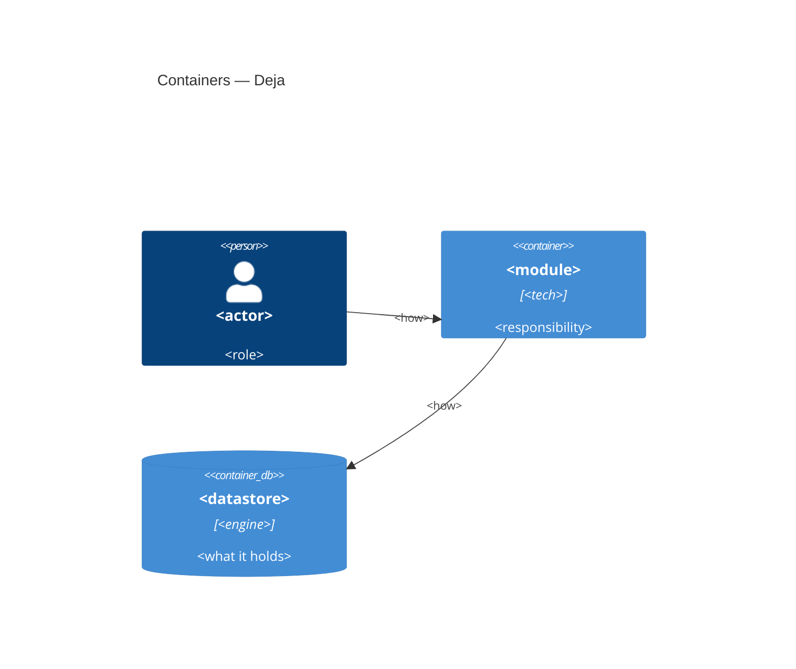

# Architecture map — Deja

> How the system is built. Produced by `map-architecture` (role T) and read by `roadmap`
> (capability dependencies), `write-prd` (constraints), `architecture-design`,
> `generate-data-model` and `implement-tasks`. Refresh with `/map-architecture` when the repo
> drifts past `reflects_commit`. In `greenfield-bootstrap` mode this describes the **target**
> baseline the scaffold will build; in `current` mode, what exists, with `file:line` anchors.
> Decisions with their alternatives live in `docs/adr/`; this file states the result.

## Stack

<!-- instruction: the fixed stack, one line per layer, each linked to its ADR. In current mode, cite the file that proves it. -->

- Language / runtime: <…> — ADR [[0001-…]]
- Web framework / ORM / migrations: <…>
- Datastore + search: <…> — ADR [[0002-…]]
- Queue / worker: <…> — ADR [[…]]
- Embeddings: <model, dimension, provider> — ADR [[…]]
- Client: <…>
- Deploy: <…>
- Build / test / lint commands: <the one local check command + its parts — feeds `implement-tasks` and `CLAUDE.md` → Commands>

## C4 — containers

<!-- instruction: Context + Container. Greenfield: the target baseline. Current: what exists. Real names, no placeholders. Validate per _shared/mermaid-check.md. -->

## Module layout

<!-- instruction: one row per top-level module/package: path, layers, where it is wired, responsibility. Greenfield: the target layout the scaffold creates. -->

| Module | Path | Layers | Wired at | Responsibility |
|---|---|---|---|---|
| <name> | `<path>` | <api / domain / infra> | `<file:line>` or «scaffold S1» | <one line> |

## Record and chunk invariants

<!-- instruction: the rules every table and every record type follows. Each links to its ADR. These are what generate-data-model checks each feature's schema against. -->

- `user_id` on every table — ADR [[…]]
- One chunk structure for all record types: <fields> — ADR [[…]]
- Lifecycle fields on every record: <fields, empty in v1> — ADR [[…]]
- Embedding dimension fixed at <N>; changing the model = reindex — ADR [[…]]
- <other>

## Conventions (the rules a new feature must match)

<!-- instruction: cross-cutting patterns. Greenfield: the rule the scaffold establishes. Current: one cited example each. -->

- **Module wiring / registration:** <pattern> — `<file:line>` / scaffold task
- **Error handling:** <pattern>
- **IDs:** <pattern>
- **Persistence / DB access:** <pattern>
- **Migrations:** <tool + naming>
- **Tests:** <unit / integration style; integration runs on a real Postgres>
- **Background work:** <how a job is enqueued, claimed, retried>
- **Source adapters:** <the one interface every source implements; output = chunks in the shared structure>
- **Config / secrets:** <`.env` + `.env.example`>

## Datastores

| Store | Engine | Accessed via | Holds |
|---|---|---|---|

## Capability dependencies

<!-- instruction: one row per slug from docs/idea-brief.md «Складові продукту». Only hard technical needs («cannot run without»). This is the ONLY constraint roadmap accepts; order preferences do not belong here. -->

| Capability | Needs first | Why (technical) |
|---|---|---|
| `<slug>` | `_scaffold` / `<slug>` / <foundation piece> | <one line> |

## Operations

<!-- instruction: backups (where the off-server copy lives, restore test cadence), monitoring and logging baseline, AI cost accounting. State what is in the scaffold, what waits for a later task, what is open. -->

- **Backups:** <…>
- **Monitoring / logs:** <…>
- **AI cost accounting:** <…>

## Frontend / UI foundation

<!-- instruction: fill once extension/ exists: structure, shared pieces, the representative screen to reuse. Until then: "N/A — the extension is the first client; no UI foundation yet." -->

## Constraints & known tech-debt

<!-- instruction: what a new feature must respect or work around. Feeds write-prd §2 / architecture-design. -->

- <constraint> — <impact on new work>

## Open

<!-- instruction: decisions deferred during the foundation walk, each with the reason and the stage that must decide it. Items returned to P are listed with «→ P». Never silently dropped. -->

- <decision> — deferred because <…>; decide at <stage>

## Reconciliation with authored docs

<!-- instruction: CLAUDE.md, existing ADRs, a previous map: note alignment and any drift found. Greenfield first run: "candidate table reconciled; replaced: <list or none>." -->
