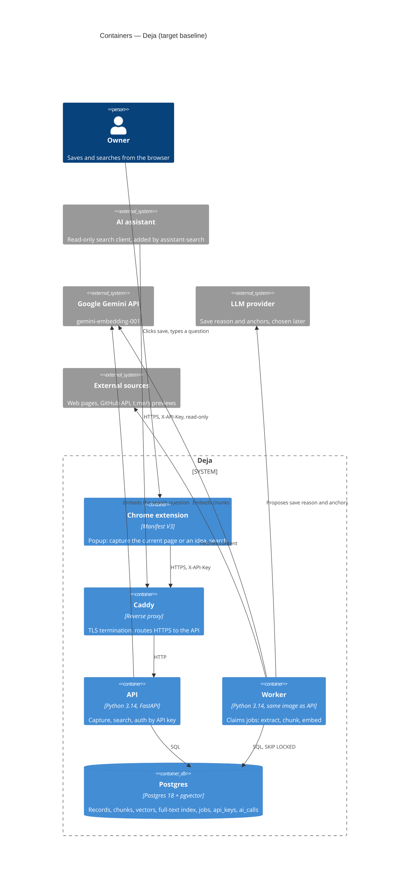

# Architecture map — Deja

> How the system is built. Produced by `map-architecture` (role T) and read by `roadmap`
> (capability dependencies), `write-prd` (constraints), `architecture-design`,
> `generate-data-model` and `implement-tasks`. Refresh with `/map-architecture` when the repo
> drifts past `reflects_commit`. In `greenfield-bootstrap` mode this describes the **target**
> baseline the scaffold will build; in `current` mode, what exists, with `file:line` anchors.
> Decisions with their alternatives live in `docs/adr/`; this file states the result.

## Stack

- Language / runtime: Python 3.14, managed with `uv` (lock file committed) — ADR [0001](adr/0001-use-python-fastapi-sqlalchemy-backend.md)
- Web framework / ORM / migrations: FastAPI, SQLAlchemy 2.x async (ORM for CRUD, Core for search queries), Alembic, Pydantic v2 + pydantic-settings — ADR [0001](adr/0001-use-python-fastapi-sqlalchemy-backend.md)
- Datastore + search: one Postgres 18 with pgvector (vector search) and built-in full-text search (keyword search) — ADR [0002](adr/0002-use-postgres-for-vectors-and-full-text-search.md)
- Queue / worker: `jobs` table in Postgres, worker claims with `SELECT … FOR UPDATE SKIP LOCKED` — ADR [0003](adr/0003-use-postgres-jobs-table-as-queue.md)
- Embeddings: Google `gemini-embedding-001`, truncated to 1536 dimensions; model name stored with every vector — ADR [0004](adr/0004-use-gemini-embedding-001-at-1536-dimensions.md)
- LLM (save reason, anchors): **open** — chosen in `architecture-design` of `save-reason-and-anchors`
- Client: Chrome extension (Manifest V3). The API is the product; the extension is one client. Extension tooling is **open**.
- Deploy: Docker Compose on Hetzner CX23 (2 vCPU, 4 GB RAM, 40 GB disk): Caddy, API, worker, Postgres. Manual `deploy/deploy.sh` over SSH.
- Build / test / lint commands: one check command `uv run poe check` (poethepoet tasks in `backend/pyproject.toml`) = `ruff check` + `ruff format --check` + `mypy --strict` + `pytest` (unit + integration) + migration round-trip. CI runs the same command on every PR.

## C4 — containers

Target baseline after the first features. The scaffold builds API, worker placeholder and Postgres; the external systems arrive with the features that need them.

## Module layout

Modules by domain area (vertical slices) — ADR [0006](adr/0006-organize-backend-by-domain-modules.md). Every module has the same files: `router.py` (HTTP), `service.py` (logic, the only entry point for other modules), `models.py` (tables), `schemas.py` (Pydantic). A module never imports another module's internals. Modules are not the brief's slugs: one feature may touch 2–3 modules.

| Module | Path | Layers | Wired at | Responsibility |
|---|---|---|---|---|
| core | `backend/app/core/` | config, db, auth, errors, logging, ids | scaffold S1, S5, S6 | Settings from `.env`, DB session, API-key auth, error envelope, JSON logging, UUID v7 |
| records | `backend/app/records/` | router / service / models / schemas | first feature (`web-page-slice`) | Records, chunks, record links; capture API; dedup |
| sources | `backend/app/sources/` | adapter interface + `web/`, `github/`, `telegram/` | first feature; one subfolder per source feature | Turn URL (+ optional client HTML) into chunk drafts |
| indexing | `backend/app/indexing/` | service + clients | first feature | Chunking, embeddings client, LLM client, `ai_calls` accounting |
| search | `backend/app/search/` | router / service | first feature | Hybrid search: vector + full-text, ranked |
| jobs | `backend/app/jobs/` | service / models + worker loop | worker entry in scaffold S4; real queue in `background-indexing` | Enqueue, claim, retry, status |
| entry point | `backend/app/main.py` | — | scaffold S1 | Creates the app, includes every router |
| extension | `extension/` | — | `chrome-extension` | The browser client |
| deploy | `deploy/` | — | scaffold S4, S9 | Compose files, Caddyfile, `deploy.sh`, backup cron |

## Record and chunk invariants

ADR [0005](adr/0005-fix-record-and-chunk-invariants.md). `generate-data-model` checks every feature's schema against these.

- `user_id` on every table (`[assume:users=one]` may change; friends with keys are in brief §3).
- One `chunks` table for all record types: `text`, `embedding vector(1536)`, `embedding_model`, `record_id`, `ordinal` (order inside the record), `locator` (JSONB; fields defined per source feature, e.g. `{"paragraph": 12, "text_start": "…"}`, `{"section": "Testing"}`, `{"t": 754}`).
- Every vector stores `embedding_model`. Changing the model = a re-embed job over the corpus — ADR [0004](adr/0004-use-gemini-embedding-001-at-1536-dimensions.md).
- Vector dimension ≤ 2000 (pgvector HNSW index limit for `vector`); fixed at 1536.
- Lifecycle fields on every record: `expires_at`, `resurface_at`, `status` (`active` / `archived`). Empty and unprocessed in v1 (brief §5); exported by `data-export`.
- Record → record links live in `record_links(from_record_id, to_record_id, kind)`; the only `kind` is `trigger` (idea → trigger source). No manual links (`docs/CONTEXT.md` → trigger).
- How the save reason and anchors are stored and searched is decided by `save-reason-and-anchors`; it reuses the chunk structure or extends it through an ADR.

## Conventions (the rules a new feature must match)

- **Module wiring / registration:** each module exposes `router` in `router.py`; `app/main.py` includes it — scaffold S1.
- **Error handling:** every API error is `{"error": {"code": "<snake_case>", "message": "<English, for developers>"}}` with the matching HTTP status. The extension maps `code` to Ukrainian user text — scaffold S6.
- **IDs:** UUID v7, generated by the app (`uuid.uuid7()`), primary key of every table.
- **Persistence / DB access:** SQLAlchemy 2.x async sessions from `core`; ORM for CRUD; SQLAlchemy Core for search and other hand-tuned queries. No raw string SQL outside `search/` and `jobs/`.
- **Migrations:** Alembic, file name `YYYYMMDD_HHMM_<what_changes>.py`; every migration has a working `downgrade`; the check command runs upgrade → downgrade → upgrade on a fresh database.
- **Tests:** pytest. Unit tests for pure code (adapters run on saved HTML fixtures). Integration tests on a real Postgres + pgvector container — no SQLite, no DB mocks. AI calls are replaced by recorded responses; no test pays or needs the network.
- **Types and lint:** `mypy --strict` and `ruff` must pass; part of the check command.
- **Logging:** structured JSON logs; fields `record_id`, `job_id`, `source_type`, `error` when present — scaffold S6.
- **Background work:** a job row is written in the same transaction as the record it serves; the worker claims with `FOR UPDATE SKIP LOCKED`, retries with exponential backoff, ends in `done` or `failed` — ADR [0003](adr/0003-use-postgres-jobs-table-as-queue.md). Built by `background-indexing`.
- **AI cost accounting:** every AI call (embedding or LLM) writes one row to `ai_calls` (`record_id`, `kind`, `model`, `tokens_in`, `tokens_out`, `cost_usd`, `created_at`). The first feature that calls AI (`web-page-slice`) creates the table. Separate from `jobs`, because AI calls may happen before the queue exists.
- **Source adapters:** one interface. Input: URL + optional page HTML supplied by the client. Output: title, canonical URL, list of chunk drafts (`text`, `ordinal`, `locator`). An adapter never writes to the DB and never calls AI; `indexing` embeds and stores. The adapter is picked by URL; the fallback is `web`. The library per source is chosen in that feature's `architecture-design`.
- **Auth:** `X-API-Key` header on every endpoint except `/health`. Table `api_keys` stores only the SHA-256 hash and `user_id`. Keys are issued by a server CLI command (`create-key --user …`); there is no registration — scaffold S5.
- **Config / secrets:** pydantic-settings reads `.env`; `.env.example` lists every variable and stays current.
- **Check command:** `uv run poe check`; CI (GitHub Actions) runs the same command on every PR with a Postgres + pgvector service container — scaffold S7, S8.

## Datastores

| Store | Engine | Accessed via | Holds |
|---|---|---|---|
| Main DB | Postgres 18 + pgvector (`pgvector/pgvector:pg18` image) | SQLAlchemy async (`core` session) | users, api_keys, records, chunks + vectors, full-text index, record_links, jobs, ai_calls |

Full-text search uses the `simple` configuration (no stemming), because records, save reasons and questions mix Ukrainian, Russian and English. The vector signal covers meaning across forms and languages.

## Capability dependencies

Only hard technical needs: «cannot run without». This is the only constraint `roadmap` accepts; order arguments (value, dogfooding, risk) belong to P.

| Capability | Needs first | Why (technical) |
|---|---|---|
| `web-page-slice` | `_scaffold` | needs the API, the DB with the invariants, and auth |
| `chrome-extension` | `web-page-slice` | the extension only calls the capture and search API |
| `save-reason-and-anchors` | `web-page-slice`, `chrome-extension` | adds a signal to the existing pipeline and search; accept / edit / skip happens in the popup |
| `ideas` | `web-page-slice`, `chrome-extension`, `save-reason-and-anchors` | shared chunks and vector search; the trigger is the current page from the popup; idea anchors use the anchor mechanism |
| `background-indexing` | `web-page-slice`, `chrome-extension` | moves the existing pipeline to the worker; record status is shown in the popup |
| `github-repo` | `web-page-slice` | a new adapter in the shared pipeline |
| `telegram-post` | `web-page-slice` | a new adapter in the shared pipeline |
| `search-eval` | `web-page-slice`, `save-reason-and-anchors` | measures the search API; the «with / without save reason» comparison needs the save reason |
| `data-export` | `web-page-slice` | exports records, chunks and links; the first feature creates these tables |
| `assistant-search` | `web-page-slice` | another client of the same search API |
| `youtube-video` (later) | `web-page-slice` | a new adapter in the shared pipeline |

Not dependencies (checked, left to P): source adapters → `background-indexing` (a README, a post or a one-hour transcript is seconds of work; synchronous capture works, only slower); `github-repo` → `save-reason-and-anchors` (the adapter works without it; full value needs it); `assistant-search` after `search-eval` is P's rule from brief §12, read from the brief.

## Operations

- **Backups:** nightly `pg_dump` on the server by cron — scaffold S9. The off-server copy location is **open** (due before the first deploy). The first restore test is in the operations work (plan epic 8), not in the scaffold. Brief §10 risk «no off-server copy, no restore test» stays open until both are done.
- **Monitoring / logs:** structured JSON logs from the scaffold (S6). Processing health — failed jobs count, oldest queued job age, time of the last save — is part of the `background-indexing` DoD (a `status` command or endpoint). Disk and error alerts, dashboards: operations work (plan epic 8).
- **AI cost accounting:** `ai_calls` rows from the first AI call (`web-page-slice`). Monthly and per-record report: operations work (plan epic 8). Verify the per-token price on the first bill; public price sources disagree.

## Frontend / UI foundation

N/A — the extension is the first client; no UI foundation yet.

## Constraints & known tech-debt

- Postgres `ts_rank` is not BM25; keyword ranking is weaker than a search engine's. If `search-eval` shows weak keyword hits, add ParadeDB `pg_search` (BM25 inside Postgres) without changing the datastore.
- No Ukrainian stemming in Postgres full-text search (`simple` configuration) — exact word forms only on the keyword signal.
- Texts and questions go to Google for embeddings. Fine for the owner; a privacy question for a second user (brief §14, due before the first friend's key).
- One small server (4 GB RAM): no local models, no extra services without a reason in an ADR.
- Code is written by agents (brief §10): `mypy --strict`, tests and the module rule are the owner's way to read and trust it.
- The scaffold does not pre-build out-of-scope items (brief §5): no web UI, no bot, no RLS, no billing; only `user_id` everywhere.

## Open

- Off-server backup copy location (shown: Backblaze B2 / Cloudflare R2 via restic — recommended; Hetzner Storage Box; Hetzner snapshots as an add-on) — deferred by T; decide before the first deploy.
- Domain name for HTTPS (the extension needs HTTPS) — needed before the first deploy.
- LLM provider and model for save reason and anchors — decide in `architecture-design` of `save-reason-and-anchors`.
- Extension tooling (plain JS or TypeScript with a bundler) — decide in `architecture-design` of `chrome-extension`.
- Storage and search of the save reason and anchors (a chunk kind or a separate vector) — `save-reason-and-anchors`.
- Hybrid ranking formula (e.g. reciprocal rank fusion) — `web-page-slice`; tuned by `search-eval`.
- → P: save reason at click vs background processing first (brief §14) — `/roadmap`.

## Reconciliation with authored docs

Candidate table (`.claude/skills/map-architecture/references/foundation.md`) reconciled; replaced: none. Deferred: off-server backup location. Kept as in the plan: first restore test in operations work. Added beyond the candidates: `embedding_model` per vector, `ai_calls` table, `ordinal` + `locator` chunk position, `uv run poe check`. Corrected: the plan says «BM25 via Postgres FTS» — Postgres FTS ranking is not BM25 (see Constraints). `CLAUDE.md` gets a short Stack section pointing here in scaffold S10.
